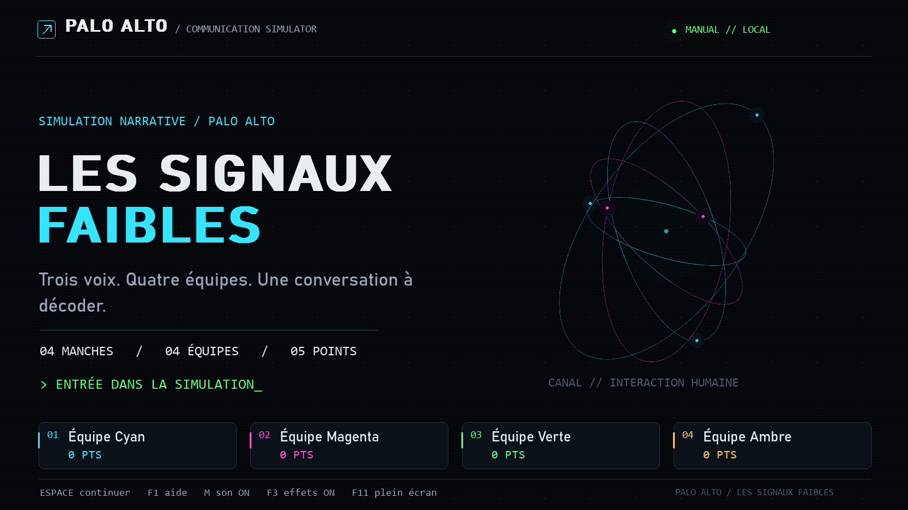
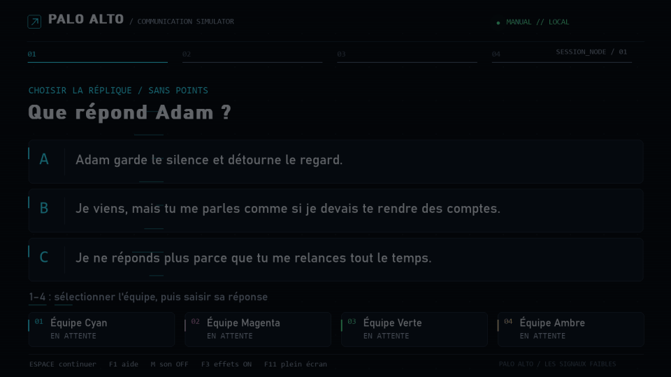
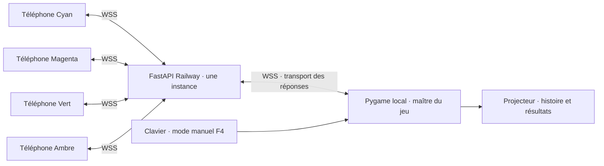
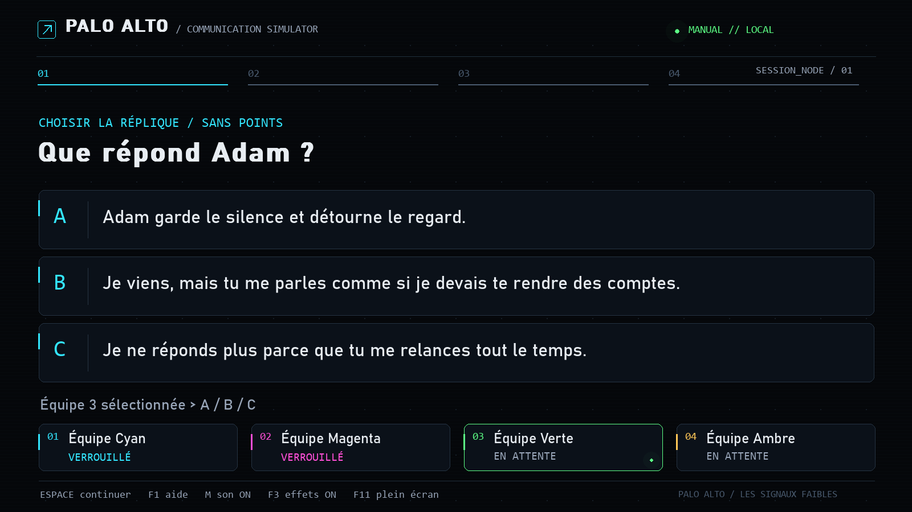
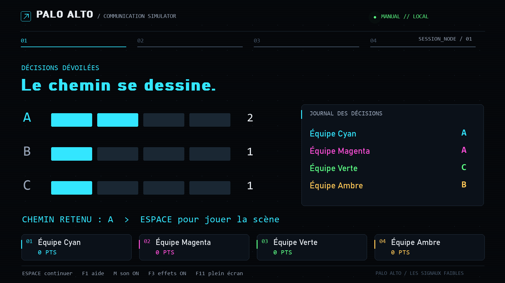
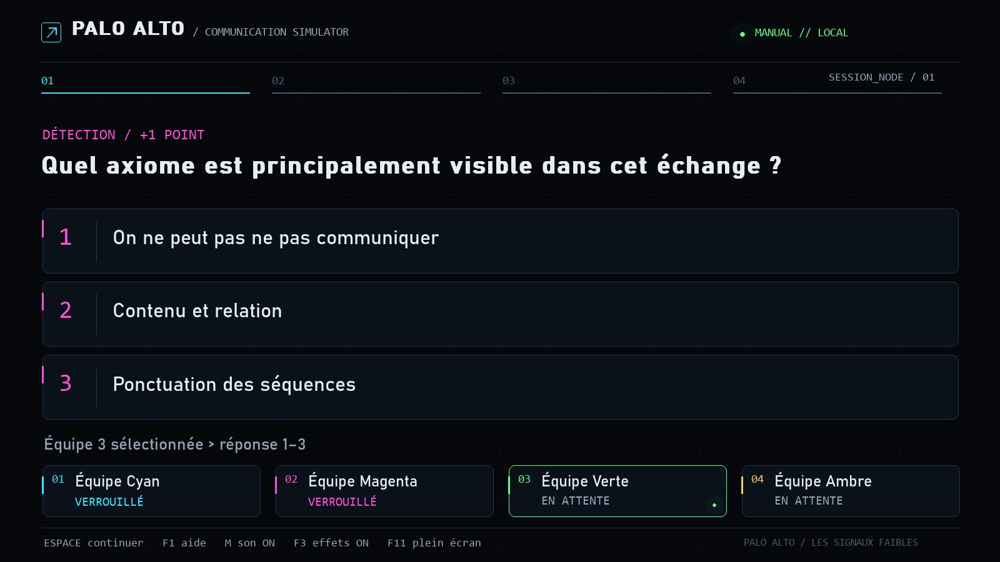
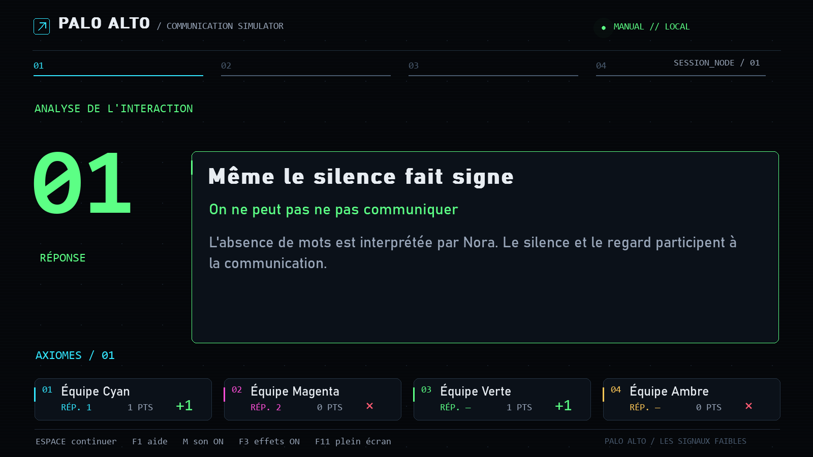
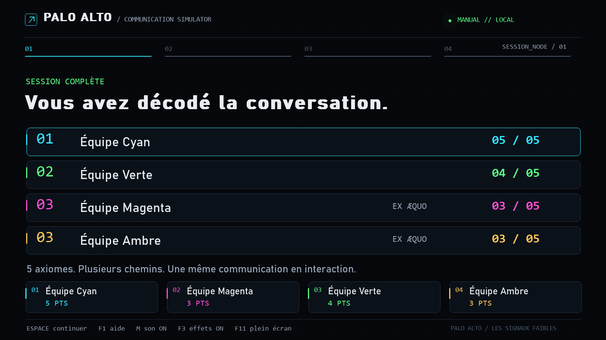

# Palo Alto — Les signaux faibles

Une simulation narrative en français pour un ordinateur Windows relié à un projecteur. Quatre équipes choisissent ensemble la prochaine réplique, puis analysent séparément l'interaction. **Quatre manches, trois choix A/B/C, cinq points maximum.** Durée indicative : 6–8 minutes, entièrement au rythme de l'animateur.



## Lancer tout de suite

Double-cliquez sur **launch.bat**. Après compilation, il ouvre `dist/PaloAlto.exe`. Le mode manuel fonctionne sans connexion Internet ni serveur.

**Livraison vérifiée :** 30 tests Python réussis, partie complète avec quatre contrôleurs en local et sur Railway, interface mobile testée à trois largeurs, EXE construit et lancé. Le backend Railway est **arrêté après les essais**, sans déploiement actif ; redémarrez-le avant d'utiliser **launch-online.bat**. Voir [la preuve et la reprise](docs/RAILWAY.md).

**Audio et animations :** annonces système courtes traitées en radio, sons de sélection/verrouillage, hops de cartes et transitions numériques. **M** coupe le son ; **F3** réduit les mouvements. Les téléphones démarrent silencieusement et proposent **SON / OFF** et **EFFETS / CALME**. Vibration disponible selon l'appareil. [Sources, licences et détails](docs/AUDIO_MOTION.md).



Pour lancer depuis les sources, utilisez Python 3.12 ou supérieur :

```powershell
python -m venv .venv
.\.venv\Scripts\python.exe -m pip install -r requirements.txt
.\.venv\Scripts\python.exe main.py
```

Dans un environnement Python qui possède déjà les dépendances :

```powershell
python main.py
```

`python main.py --windowed` ouvre une fenêtre de développement. F11 bascule le plein écran. La surface 1600 × 900 est proportionnellement adaptée à 1920 × 1080, 1600 × 900, 1366 × 768 et aux autres dimensions sans déformer le contenu.

## Jouer et saisir les noms

L'écran de préparation permet de saisir quatre noms (24 caractères maximum). La première frappe remplace le nom par défaut ; TAB et les flèches changent d'équipe. ENTRÉE passe au nom suivant puis valide le dernier. Les champs vides retrouvent leur nom par défaut.

La majorité choisit une branche commune à tout le monde. Aucun dialogue ne rapporte de points. Chaque bonne analyse rapporte +1 aux manches 1–3 et +2 à la manche 4. Les scores finaux acceptent les ex æquo.

| Touche | Action |
|---|---|
| ESPACE / ENTRÉE | Terminer l'animation, puis avancer ; révéler seulement après quatre réponses |
| 1–4 puis A/B/C | Saisie manuelle du dialogue : équipe puis choix |
| 1–4 puis 1–4 | Saisie manuelle de l'analyse : équipe puis numéro de réponse |
| RETOUR ARRIÈRE | Annuler la dernière saisie avant révélation ; en ligne, rouvrir cette équipe |
| 1–4 puis SUPPR | En ligne : sélectionner puis rouvrir une équipe |
| A/B/C en cas d'égalité | Sélectionner uniquement une option ex æquo |
| F4 | Passer au clavier en conservant les réponses reçues ; retour en ligne à l'accueil/transition |
| N | Test réseau/création de session à l'accueil ; nouvelle session après une panne serveur |
| T | Lancer/arrêter le chrono facultatif ; aucune réponse forcée à zéro |
| P | Pause/reprise des animations et du chrono |
| R | Menu de reprise ; choisir R (phase), C (manche), G (partie), puis confirmer par ENTRÉE |
| ÉCHAP | Menu de sortie ; ENTRÉE confirme, ÉCHAP annule |
| F1 | Aide |
| F2 | HUD public de diagnostic, sans réponse correcte |
| F11 | Plein écran/fenêtre |

**Analyse :** après avoir sélectionné une équipe, la frappe numérique suivante est une réponse. RETOUR ARRIÈRE permet d'annuler une erreur. Le numéro de l'équipe active est montré sous les options et son panneau est éclairé.

Les réponses restent cachées tant que les quatre équipes n'ont pas répondu et que l'animateur n'a pas appuyé sur ESPACE. Les animations sont courtes et sautables. Pas de son requis ni de piste audio.

## Téléphones — développement local

Le backend sert les contrôleurs mobiles et les WebSockets sur le même port. Il ne diffuse pas l'écran Pygame.

```powershell
.\.venv\Scripts\python.exe -m uvicorn backend.main:app --host 0.0.0.0 --port 8018
```

Puis, dans un deuxième terminal :

```powershell
$env:PALO_ALTO_SERVER_URL="http://127.0.0.1:8018"
.\.venv\Scripts\python.exe main.py --windowed
```

À l'accueil, une session et un QR commun sont générés ; N effectue le test de connexion. Les indicateurs BACKEND / WEBSOCKET doivent montrer OK. Chaque téléphone choisit son équipe, sélectionne une réponse puis la verrouille. Pendant la narration, il invite à regarder le projecteur.

**Téléphones physiques sur le réseau local :** `127.0.0.1` désigne le téléphone lui-même. Utilisez l'adresse LAN du PC, par exemple `http://192.168.1.20:8018`, autorisez le port dans le pare-feu Windows et configurez `PALO_ALTO_ALLOW_LAN_HTTP=1` uniquement pour ce réseau de confiance. Pour une utilisation publique, utilisez HTTPS/WSS Railway.

PIN facultatifs : `PALO_ALTO_TEAM_PINS=1234,2345,3456,4567` avant le lancement du projecteur. Sans cette variable, aucun PIN. Les secrets de contrôleur sont enregistrés localement dans le navigateur ; une équipe réservée ne peut pas être volée par un second téléphone.

## Reprise en cas de panne

**F4** passe immédiatement en mode manuel et conserve les réponses déjà reçues. Les messages tardifs des téléphones sont ignorés. Terminez la manche au clavier. Le retour en ligne est autorisé seulement à l'accueil ou entre deux manches.

Une coupure WebSocket reconnecte automatiquement le projecteur et les téléphones ; une reconnexion envoie un instantané de la phase actuelle, du score personnel et de la réponse déjà verrouillée.

Les sessions sont en mémoire, avec expiration après trois heures sans activité. **Un redémarrage du backend perd les salles et les réservations.** L'histoire et les scores locaux restent sur le projecteur : F4 pour poursuivre, puis N à la transition pour créer une nouvelle salle ; les équipes scannent alors le nouveau QR. Ne changez pas de serveur en plein vote.

## Modifier le scénario

Éditez **data/scenarios.json** avec un éditeur UTF-8. Après compilation, le fichier adjacent à l'EXE (`dist/data/scenarios.json`) est prioritaire sur la copie intégrée.

Tous les personnages, dialogues, branches, questions, réponses, explications et délais sont dans ce JSON. Les réponses correctes sont **numérotées à partir de 1**, comme sur l'écran.

```json
{
  "text": "Tu coordonnes la répétition ; je vérifie les sources.",
  "branch": [
    {"speaker": "Adam", "text": "Tu coordonnes la répétition ; je vérifie les sources."}
  ],
  "analysis": {
    "question": "Quel type d'organisation est accepté ici ?",
    "answers": ["Symétrique", "Complémentaire", "Aucune interaction"],
    "correct": 2,
    "label": "Des rôles qui se complètent",
    "axioms": [5],
    "explanation": "Les deux partenaires acceptent des positions différentes : interaction complémentaire."
  }
}
```

Conservez quatre manches et trois choix A/B/C par manche. Chaque branche doit avoir 1–3 lignes et sa propre analyse, avec 3–4 réponses. `characters` associe noms et couleurs ; les `speaker` doivent correspondre à ces noms. `prompt` définit la question de vote. `points` suit 1, 1, 1, 2. `timing` contient le débit de frappe et les chronos facultatifs.

Les limites de longueur sont validées pour préserver la lisibilité : dialogue 220 caractères, choix 125, réponse 150, analyse/explication 260. Une erreur affiche le fichier et le champ à corriger, sans traceback projeté. Un autre fichier peut être testé avec `--scenario chemin.json`.

## Architecture



- **Pygame** possède les phases, le scénario, le chemin narratif, les scores et les animations.
- **FastAPI** possède les salles, les quatre identités, les connexions, les verrouillages temporaires et la validation des messages.
- **HTML/CSS/JS** affiche uniquement la demande courante, la réponse personnelle, l'attente et les résultats autorisés.

Un identifiant de session, de manche et de phase protège les réponses retardées. Une répétition identique est acquittée sans compter deux fois ; une réponse différente déjà verrouillée est refusée. Les instantanés sont adaptés au rôle. Le serveur ne transmet jamais la bonne réponse pendant la collecte.

## Structure

```text
palo_alto_axiomes_game/
├── main.py                     # Boucle Pygame, clavier, mode manuel/en ligne
├── src/
│   ├── game.py                 # Machine à états, majorité, départage, scores
│   ├── renderer.py             # Composition des écrans et animations
│   ├── ui_components.py        # Polices, retours à la ligne, orbites vectorielles
│   ├── network.py              # Transport WebSocket en thread, heartbeat, reprise
│   └── scenario_loader.py      # Validation JSON avec erreurs lisibles
├── data/scenarios.json         # Histoire complète, 12 branches
├── backend/
│   ├── main.py                 # FastAPI, REST, salles, WebSockets
│   └── static/                 # index.html, styles.css, app.js
├── scripts/
│   ├── simulate.py             # Vrai projecteur + quatre contrôleurs simulés
│   └── preview.py              # Captures de tous les écrans majeurs
├── tests/                      # Tests moteur, transport et interfaces
├── docs/PLAN.md                # Plan et exigences annotées
├── docs/VALIDATION.md           # Résultats observés et limites
├── docs/RAILWAY.md              # Déploiement, identité du service, arrêt/reprise
├── docs/screenshots/           # Captures de l'application réelle
├── requirements.txt
├── PaloAlto.spec
├── build.bat
├── launch.bat
├── Dockerfile
└── railway.toml
```

## Qualité graphique

Les graphiques sont vectoriels, générés localement : orbites de messages, halo, trame discrète, curseur, panneaux et barres terminal. Le projecteur utilise les polices système Bahnschrift/Segoe UI et Consolas, avec alternatives DejaVu/Liberation et secours Pygame. Aucun téléchargement à l'exécution. Les couleurs d'équipe restent identiques sur le projecteur et les mobiles.







Autres écrans : [préparation](docs/screenshots/01-setup.png), [brief](docs/screenshots/03-brief.png), [narration](docs/screenshots/04-story.png), [égalité](docs/screenshots/07-tie.png), [branche](docs/screenshots/08-branch.png), [transition](docs/screenshots/11-transition.png), [fin](docs/screenshots/13-end.png), [QR en ligne](docs/screenshots/14-network-lobby.png), [mobile](docs/screenshots/15-mobile-join.png).

## Tests

```powershell
.\.venv\Scripts\python.exe -m pytest -q
.\.venv\Scripts\python.exe scripts/preview.py
.\.venv\Scripts\python.exe scripts/simulate.py --server http://127.0.0.1:8018
```

La simulation nécessite un backend démarré. Elle ouvre le vrai transport du projecteur, crée quatre contrôleurs, parcourt quatre manches, vérifie un départage, reconnecte un contrôleur et vérifie les scores et la fermeture de salle. Elle ne nécessite aucun téléphone physique.

Vérification mobile automatisée facultative (Node.js 22 ou supérieur) :

```powershell
npm install
npx playwright install chromium
npm run test:mobile
```

Le test utilise le backend local sur le port 8018 ; `PALO_ALTO_SERVER_URL` permet de cibler un autre serveur. Node et Playwright servent uniquement aux essais, pas à l'application ni au backend.

## Construire l'EXE Windows

Lancez **build.bat** depuis Windows après installation des dépendances. Il utilise le fichier PyInstaller fourni, intègre le JSON et copie une version modifiable à côté de l'EXE. Résultat : **dist/PaloAlto.exe**.

Vous pouvez distribuer l'EXE seul (scénario intégré), ou l'EXE avec `data/scenarios.json` pour permettre les modifications. Aucun serveur n'est nécessaire pour le mode manuel. Le backend Railway est une image Python minimale distincte ; il n'installe pas Pygame.

## Before the presentation

1. Redémarrer uniquement le service Railway de ce jeu — procédure exacte dans [RAILWAY.md](docs/RAILWAY.md).
2. Vérifier `/health`.
3. Configurer `PALO_ALTO_SERVER_URL` avec le domaine HTTPS et lancer Pygame.
4. Vérifier les noms puis N à l'accueil ; BACKEND et WEBSOCKET doivent être OK.
5. Projeter le QR de la nouvelle session.
6. Connecter quatre contrôleurs, vérifier 4/4.
7. Démarrer avec ESPACE.
8. Si Internet tombe : F4, puis annoncer les réponses à l'animateur.

## After the presentation

1. Continuer jusqu'à l'écran de fin, puis ÉCHAP et ENTRÉE pour quitter et fermer la salle.
2. Arrêter uniquement le service Railway de ce jeu — procédure dans [RAILWAY.md](docs/RAILWAY.md).
3. Vérifier l'absence de déploiement actif. Ne laissez pas une session de test consommer des crédits.

## Références techniques

Implémentation fondée sur la [documentation Pygame display](https://www.pygame.org/docs/ref/display.html), les [WebSockets FastAPI](https://fastapi.tiangolo.com/advanced/websockets/) et la [documentation Railway CLI](https://docs.railway.com/cli). Les décisions pédagogiques proviennent des documents joints ; les exemples sont de courtes scènes originales.
