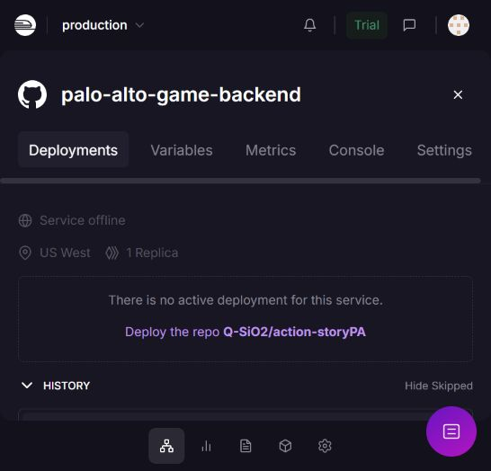

# Railway — service dédié à ce jeu

## Identité

| Élément | Valeur |
|---|---|
| Dépôt | https://github.com/Q-SiO2/action-storyPA |
| Projet | energetic-solace |
| Project ID | 222b323a-d8fd-4cfc-8e89-d7a02fdefc6f |
| Environnement | production |
| Environment ID | 07015e4b-6cc9-43eb-8cc8-99847d30175e |
| Service | palo-alto-game-backend |
| Service ID | 35a777d0-1f03-4603-927d-2736f6ea6d01 |
| Domaine | https://palo-alto-game-backend-production.up.railway.app |

La création d'un nouveau projet a été refusée par la limite gratuite. Le projet existant **energetic-solace**, vérifié vide, a donc reçu uniquement ce nouveau service. Le projet **appealing-charisma** et son service **paloalto-live** n'ont pas été modifiés.

## Configuration

Un Dockerfile Python 3.12 héberge uniquement FastAPI et le client mobile. Pas de base de données, de Redis, de worker ni de cron. Les salles vivent en mémoire : **une seule instance** et un seul worker. La configuration utilise `PORT=8000`, une route publique vers le port 8000, `PUBLIC_URL=https://palo-alto-game-backend-production.up.railway.app` et la vérification `/health`.

Le projecteur se configure ainsi :

```powershell
$env:PALO_ALTO_SERVER_URL="https://palo-alto-game-backend-production.up.railway.app"
.\.venv\Scripts\python.exe main.py
```

La même variable s'applique à l'EXE :

```powershell
$env:PALO_ALTO_SERVER_URL="https://palo-alto-game-backend-production.up.railway.app"
.\dist\PaloAlto.exe
```

Le script de lancement en ligne est aussi fourni : `launch-online.bat`.

## Before the presentation

Le service est intentionnellement arrêté après les essais. **Aucun déploiement actif** ; le paramètre de capacité conserve une réplique pour la prochaine utilisation.

Procédure directement vérifiée dans le tableau de bord :

1. Ouvrir [ce service Railway](https://railway.com/project/222b323a-d8fd-4cfc-8e89-d7a02fdefc6f/service/35a777d0-1f03-4603-927d-2736f6ea6d01?environmentId=07015e4b-6cc9-43eb-8cc8-99847d30175e).
2. Onglet **Deployments** → bouton **Deploy the repo Q-SiO2/action-storyPA**. Cette action reconstruit le backend du dépôt et réactive l'instance ; ne la lancez que pour une répétition ou la présentation.
3. Attendre un déploiement actif, puis vérifier [health](https://palo-alto-game-backend-production.up.railway.app/health) : `{"status":"ok"}`.
4. Lancer **launch-online.bat**, vérifier BACKEND / WEBSOCKET : OK, puis connecter quatre équipes.

Dans Codex, le connecteur peut aussi déclencher le redéploiement du service avec les IDs ci-dessus ; si aucune image active ne peut être redéployée, utiliser le bouton **Deploy the repo**.

## After the presentation

Quitter Pygame avec ÉCHAP puis ENTRÉE ferme la salle.

Procédure utilisée avec succès :

1. Dans le même service → **Deployments** → ouvrir le déploiement **ACTIVE**.
2. **Deployment actions** → **Remove** → confirmer **Remove**. Cette action met l'application hors ligne ; elle conserve le service, le dépôt et le domaine.
3. Vérifier **Service offline / There is no active deployment for this service**.
4. Vérifier que `/health` ne renvoie plus HTTP 200. L'endpoint renvoyait HTTP 404 après l'arrêt observé.

Après authentification et liaison au bon service, l'équivalent CLI est [`railway down`](https://docs.railway.com/cli/down). Ne supprimez pas le service ou le projet.

**Pourquoi pas zéro réplique ?** Le connecteur a refusé `numReplicas: 0` (minimum 1). Retirer la configuration d'une région a déclenché une instance dans une région par défaut ; cette tentative a été détectée par vérification indépendante et corrigée. L'arrêt final a été réalisé dans le tableau de bord en retirant le déploiement actif. Il y a **zéro instance active**, mais la capacité configurée reste 1 pour la reprise.

Les `watchPatterns` du service sont `/backend/**`, `/Dockerfile`, `/railway.toml`. Les changements de documentation/captures ne déclenchent pas de remise en ligne. Une modification du backend peut déclencher un nouveau déploiement ; vérifier ensuite l'arrêt.

## État des essais

**3 octobre 2026 :**

- Déploiement Docker réussi depuis `Q-SiO2/action-storyPA@main`.
- `GET /health` en HTTPS : HTTP 200, `{"status":"ok"}`.
- Page mobile hébergée chargée et vérifiée avec agent-browser, sans erreur détectée.
- Vrai transport Pygame + quatre clients **WSS** : quatre manches, départage, reconnexion, scores `[5,5,5,0]`, QR généré, salle fermée.
- Quatre contrôleurs Chromium sur le domaine Railway : choix/verrouillage, réouverture, rechargement, analyse, résultat, classement avec égalité ; aucune erreur JavaScript/console.
- Déploiement actif **97ebacee-9c65-4564-9433-6fc3ae803954** retiré après ces essais. Les déploiements précédents étaient déjà retirés.
- Vérification indépendante : tableau de bord **Service offline**, API Railway **latestDeployment: null**, endpoint HTTPS **HTTP 404**.

**RAILWAY GAME BACKEND — STATUS: STOPPED / NO ACTIVE DEPLOYMENT.**


